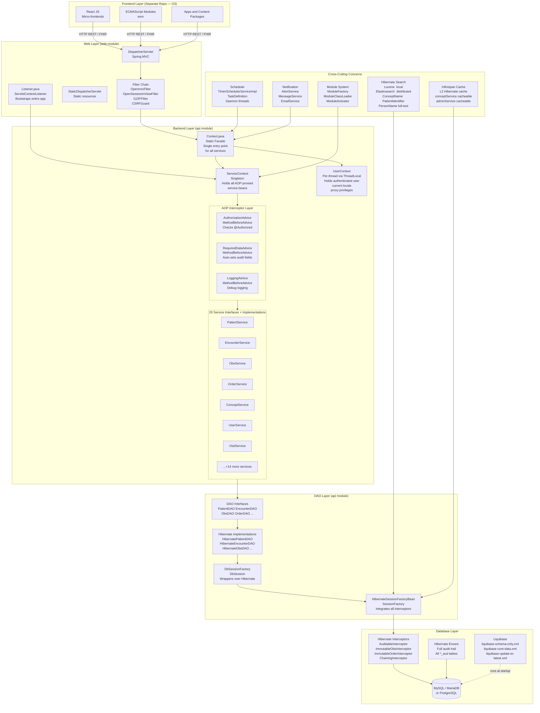
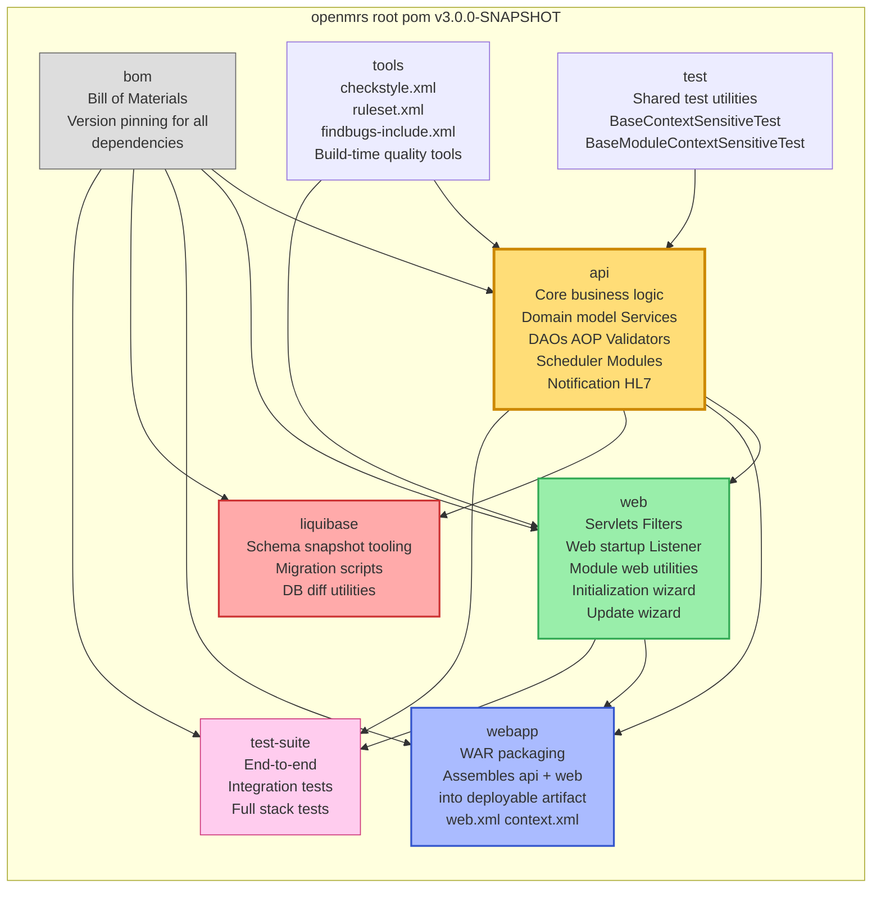
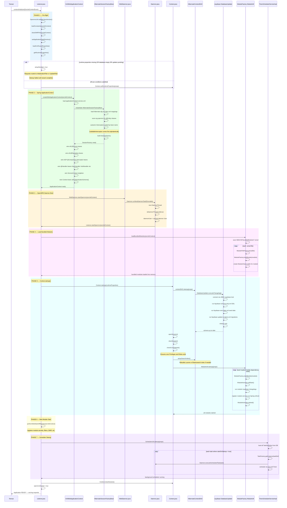

# OpenMRS Core — Complete Flow Reference
## Part 1: Architecture, Startup, Domain Model & Services

---

## 1. High-Level System Architecture



---

## 2. Maven Multi-Module Structure



---

## 3. Application Startup Sequence



---

## 4. Spring Bean Wiring Graph

```mermaid
graph TB
    subgraph XML["applicationContext-service.xml"]
        SF_BEAN["sessionFactory\nHibernateSessionFactoryBean\nconfigLocations: hibernate.cfg.xml\npackagesToScan: org.openmrs\n@Autowired interceptors by type"]
        DSF_BEAN["dbSessionFactory\nDbSessionFactory\nconstructor-arg: ref sessionFactory"]
        SVC_CTX_BEAN["serviceContext\nServiceContext.getInstance()\nfactory-method singleton\nrefs all 20+ service beans"]
        CTX_BEAN["context\nContext.java\ninit-method: setAuthenticationScheme\nproperty: serviceContext\nproperty: contextDAO"]
        EVT_BEAN["openmrsEventListeners\nEventListeners\nglobalPropertyListeners list:\n  LocaleUtility\n  LocationUtility\n  ConfigUtil\n  PersonNameGlobalPropertyListener\n  LoggingConfigurationGlobalPropertyListener\n  GlobalLocaleList\n  adminService\n  orderService"]
        VAL_BEANS["30 Validator Beans\npatientValidator\npersonValidator\nobsValidator\norderValidator\ndrugOrderValidator\nencounterValidator\nconceptValidator\nuserValidator\nroleValidator\nlocationValidator\nand more ..."]
    end

    subgraph SCAN["component-scan  base-package=org.openmrs"]
        SVC_BEANS["@Service beans\npatientService  PatientServiceImpl\nencounterService  EncounterServiceImpl\nobsService  ObsServiceImpl\norderService  OrderServiceImpl\nconceptService  ConceptServiceImpl\nuserService  UserServiceImpl\nvisitService  VisitServiceImpl\npersonService  PersonServiceImpl\nlocationService  LocationServiceImpl\nprogramWorkflowService\nconditionService\ndiagnosisService\nmedicationDispenseService\nformService\nproviderService\nadminService\nschedulerService\nalertService\ncohortService\norderSetService\nserializationService\ndatatypeService"]

        REPO_BEANS["@Repository beans\npatientDAO  HibernatePatientDAO\nencounterDAO  HibernateEncounterDAO\nobsDAO  HibernateObsDAO\norderDAO  HibernateOrderDAO\nconceptDAO  HibernateConceptDAO\nuserDAO  HibernateUserDAO\nvisitDAO  HibernateVisitDAO\npersonDAO  HibernatePersonDAO\nlocationDAO  HibernateLocationDAO\ncontextDAO  HibernateContextDAO\nadminDAO  HibernateAdministrationDAO\nand 8 more ..."]

        AOP_BEANS["@Component AOP Interceptors\nauthorizationInterceptor\n  AuthorizationAdvice\nrequiredDataInterceptor\n  RequiredDataAdvice\nauditableInterceptor\n  AuditableInterceptor\nimmutableObsInterceptor\n  ImmutableObsInterceptor\nimmutableOrderInterceptor\n  ImmutableOrderInterceptor\ndropMillisecondsInterceptor\n  DropMillisecondsHibernateInterceptor\nchainingInterceptor\n  ChainingInterceptor"]

        HANDLER_BEANS["@Handler beans\nBaseSaveHandler\nBaseVoidHandler\nBaseRetireHandler\nBaseUnvoidHandler\nBaseUnretireHandler\nConceptNameSaveHandler\nPatientSaveHandler\nEncounterSaveHandler\nOpenmrsObjectSaveHandler\nPersonSaveHandler\nUserSaveHandler\nDiagnosisAttributeSaveHandler"]
    end

    SF_BEAN    --> DSF_BEAN
    DSF_BEAN   -.->|injected into| REPO_BEANS
    REPO_BEANS -.->|@Autowired into| SVC_BEANS
    AOP_BEANS  -.->|wrap via Spring AOP| SVC_BEANS
    HANDLER_BEANS -.->|used by| AOP_BEANS
    VAL_BEANS  -.->|used by| AOP_BEANS
    SVC_BEANS  --> SVC_CTX_BEAN
    SVC_CTX_BEAN --> CTX_BEAN
    EVT_BEAN   --> SVC_CTX_BEAN

    SF_BEAN -.->|autowires| AOP_BEANS
```

---

## 5. Domain Model Class Hierarchy

```mermaid
classDiagram
    direction TB

    class OpenmrsObject {
        <<interface>>
        +Integer getId()
        +void setId(Integer id)
        +String getUuid()
        +void setUuid(String uuid)
    }

    class BaseOpenmrsObject {
        <<abstract>>
        -Integer id
        -String uuid
        +String toString()
    }

    class OpenmrsData {
        <<interface>>
        +User getCreator()
        +Date getDateCreated()
        +Boolean getVoided()
        +User getVoidedBy()
        +Date getDateVoided()
        +String getVoidReason()
    }

    class OpenmrsMetadata {
        <<interface>>
        +String getName()
        +String getDescription()
        +Boolean getRetired()
        +User getRetiredBy()
        +Date getDateRetired()
        +String getRetireReason()
    }

    class BaseOpenmrsData {
        <<abstract  MappedSuperclass  Audited>>
        #User creator
        -Date dateCreated
        -User changedBy
        -Date dateChanged
        -Boolean voided = FALSE
        -Date dateVoided
        -User voidedBy
        -String voidReason
    }

    class BaseOpenmrsMetadata {
        <<abstract  MappedSuperclass  Audited>>
        -String name
        -String description
        -Boolean retired = FALSE
        -User retiredBy
        -Date dateRetired
        -String retireReason
    }

    class Person {
        <<Entity  Table person  Audited>>
        #Integer personId
        -Set~PersonName~ names
        -Set~PersonAddress~ addresses
        -Set~PersonAttribute~ attributes
        -String gender
        -Date birthdate
        -Boolean birthdateEstimated
        -Date birthtime
        -Boolean dead = FALSE
        -Date deathDate
        -Concept causeOfDeath
        -String causeOfDeathNonCoded
        -boolean isPatient
        +PersonName getPersonName()
        +PersonAddress getPersonAddress()
        +String getGivenName()
        +String getFamilyName()
        +Integer getAge()
        +Integer getAge(Date onDate)
        +Integer getAgeInMonths()
    }

    class Patient {
        <<Audited  Cacheable>>
        -Integer patientId
        -String allergyStatus = UNKNOWN
        -Set~PatientIdentifier~ identifiers
        +PatientIdentifier getPatientIdentifier()
        +PatientIdentifier getPatientIdentifier(String typeName)
        +List~PatientIdentifier~ getActiveIdentifiers()
        +void addIdentifier(PatientIdentifier pi)
        +void removeIdentifier(PatientIdentifier pi)
    }

    class PatientIdentifier {
        <<Entity  Table patient_identifier  Indexed  Audited>>
        -Integer patientIdentifierId
        -Patient patient
        -String identifier
        -PatientIdentifierType identifierType
        -Location location
        -PatientProgram patientProgram
        -Boolean preferred = FALSE
        +boolean equalsContent(PatientIdentifier other)
    }

    class PatientIdentifierType {
        <<Entity  Table patient_identifier_type  Audited>>
        -Integer patientIdentifierTypeId
        -String format
        -Boolean required = FALSE
        -String formatDescription
        -String validator
        -LocationBehavior locationBehavior
        -UniquenessBehavior uniquenessBehavior
    }

    class Visit {
        <<Entity  Table visit  Audited>>
        -Integer visitId
        -Patient patient
        -VisitType visitType
        -Concept indication
        -Location location
        -Date startDatetime
        -Date stopDatetime
        -Set~Encounter~ encounters
        -Set~VisitAttribute~ attributes
        +void addEncounter(Encounter e)
        +List~Encounter~ getNonVoidedEncounters()
    }

    class Encounter {
        <<Entity  Table encounter  Audited>>
        -Integer encounterId
        -Date encounterDatetime
        -Patient patient
        -Location location
        -Form form
        -EncounterType encounterType
        -Visit visit
        -Set~Obs~ obs
        -Set~Order~ orders
        -Set~Diagnosis~ diagnoses
        -Set~Condition~ conditions
        -Set~EncounterProvider~ encounterProviders
        -Set~Allergy~ allergies
        +void addObs(Obs obs)
        +void addOrder(Order order)
        +Set~Obs~ getObsAtTopLevel(boolean includeVoided)
        +Set~Obs~ getAllFlattenedObs(boolean includeVoided)
        +Map~EncounterRole,Set~Provider~~ getProvidersByRoles()
        +void addProvider(EncounterRole role, Provider provider)
    }

    class Obs {
        <<Audited  — IMMUTABLE after save>>
        -Integer obsId
        -Concept concept
        -Date obsDatetime
        -Encounter encounter
        -Person person
        -Location location
        -Double valueNumeric
        -String valueText
        -Concept valueCoded
        -Date valueDatetime
        -String valueComplex
        -byte[] valueClob
        -Obs obsGroup
        -Set~Obs~ groupMembers
        -Obs previousVersion
        -Interpretation interpretation
        -Status status
        -String accessionNumber
        +boolean isDirty()
        +boolean isObsGrouping()
        +boolean hasPreviousVersion()
        +ComplexData getComplexData()
    }

    class Order {
        <<Entity  Table orders  Audited  — IMMUTABLE>>
        -Integer orderId
        -String orderNumber
        -Patient patient
        -Concept concept
        -Encounter encounter
        -Provider orderer
        -Date dateActivated
        -Date scheduledDate
        -Date autoExpireDate
        -Date dateStopped
        -Urgency urgency
        -Action action
        -Order previousOrder
        -CareSetting careSetting
        -OrderType orderType
        -String instructions
        -String commentToFulfiller
        -FulfillerStatus fulfillerStatus
    }

    class DrugOrder {
        <<Entity  Table drug_order  JOINED inheritance>>
        -Drug drug
        -String drugNonCoded
        -Double dose
        -Concept doseUnits
        -OrderFrequency frequency
        -Boolean asNeeded
        -String asNeededCondition
        -Integer duration
        -Concept durationUnits
        -Concept route
        -String brandName
        -Boolean dispenseAsWritten
        -Double quantity
        -Concept quantityUnits
        -Integer numRefills
        +void setAutoExpireDateBasedOnDuration()
    }

    class TestOrder {
        <<Entity  Table test_order  JOINED inheritance>>
        -Concept specimenSource
        -String laterality
        -String clinicalHistory
        -OrderFrequency frequency
        -Integer numberOfRepeats
    }

    class ReferralOrder {
        <<Entity  JOINED inheritance>>
    }

    class ServiceOrder {
        <<Entity  JOINED inheritance>>
    }

    class Concept {
        <<Cacheable  Indexed  Audited>>
        -Integer conceptId
        -Set~ConceptName~ names
        -Set~ConceptDescription~ descriptions
        -ConceptDatatype datatype
        -ConceptClass conceptClass
        -Set~ConceptAnswer~ answers
        -Set~ConceptSet~ conceptSets
        -Set~ConceptMap~ conceptMappings
        -Set~ConceptAttribute~ attributes
        -Boolean retired
        -Boolean set
        +ConceptName getName(Locale locale)
        +ConceptName getFullySpecifiedName(Locale locale)
        +List~ConceptAnswer~ getAnswers()
    }

    class PatientProgram {
        <<Entity  Table patient_program  Audited>>
        -Integer patientProgramId
        -Patient patient
        -Program program
        -Location location
        -Date dateEnrolled
        -Date dateCompleted
        -Concept outcome
        -Set~PatientState~ states
        -Set~PatientProgramAttribute~ attributes
        +PatientState getCurrentState(ProgramWorkflow workflow)
        +void transitionToState(ProgramWorkflowState state, Date onDate)
    }

    class Condition {
        <<Entity  Table conditions  Audited>>
        -Integer conditionId
        -CodedOrFreeText condition
        -Patient patient
        -Encounter encounter
        -Condition previousVersion
        -ConditionClinicalStatus clinicalStatus
        -ConditionVerificationStatus verificationStatus
        -Date onsetDate
        -Date endDate
        -String additionalDetail
    }

    class Diagnosis {
        <<Entity  Table encounter_diagnosis  Audited>>
        -Integer diagnosisId
        -Patient patient
        -Encounter encounter
        -CodedOrFreeText diagnosis
        -Integer rank
        -ConditionVerificationStatus certainty
        -Condition condition
    }

    class MedicationDispense {
        <<Entity  Table medication_dispense  Audited>>
        -Integer medicationDispenseId
        -Patient patient
        -DrugOrder drugOrder
        -Encounter encounter
        -Concept concept
        -Drug drug
        -String drugNonCoded
        -Concept status
        -Concept statusReason
        -Concept formNamespace
        -Concept dose
        -Concept doseUnits
        -OrderFrequency frequency
        -Concept route
        -Double quantity
        -Concept quantityUnits
        -Integer numRefills
        -Boolean wasSubstituted
        -Concept substitutionType
        -Concept substitutionReason
        -Provider dispenser
        -Location location
        -Date dateDispensed
        -String renderedDosageInstruction
    }

    class Allergy {
        <<Entity  Table allergy  Audited>>
        -Integer allergyId
        -Patient patient
        -Allergen allergen
        -Concept severity
        -String comment
        -Set~AllergyReaction~ reactions
    }

    OpenmrsObject    <|..  BaseOpenmrsObject
    BaseOpenmrsObject <|-- BaseOpenmrsData
    BaseOpenmrsObject <|-- BaseOpenmrsMetadata
    OpenmrsData      <|..  BaseOpenmrsData
    OpenmrsMetadata  <|..  BaseOpenmrsMetadata

    BaseOpenmrsData <|-- Person
    Person          <|-- Patient
    BaseOpenmrsData <|-- PatientIdentifier
    BaseOpenmrsData <|-- Visit
    BaseOpenmrsData <|-- Encounter
    BaseOpenmrsData <|-- Obs
    BaseOpenmrsData <|-- Order
    BaseOpenmrsData <|-- Condition
    BaseOpenmrsData <|-- Diagnosis
    BaseOpenmrsData <|-- MedicationDispense
    BaseOpenmrsData <|-- Allergy
    BaseOpenmrsData <|-- PatientProgram
    BaseOpenmrsMetadata <|-- Concept
    BaseOpenmrsMetadata <|-- PatientIdentifierType

    Order <|-- DrugOrder
    Order <|-- TestOrder
    Order <|-- ReferralOrder
    Order <|-- ServiceOrder

    Patient        "1" --> "many"  PatientIdentifier  : identified by
    Patient        "1" --> "many"  Visit              : attends
    Patient        "1" --> "many"  PatientProgram     : enrolled in
    Patient        "1" --> "many"  Allergy            : has
    Visit          "1" --> "many"  Encounter          : groups
    Encounter      "1" --> "many"  Obs                : records
    Encounter      "1" --> "many"  Order              : issues
    Encounter      "1" --> "many"  Diagnosis          : documents
    Encounter      "1" --> "many"  Condition          : tracks
    Obs                --> Concept                    : what was observed
    Order              --> Concept                    : what was ordered
    DrugOrder      "1" --> "0..1"  MedicationDispense : fulfilled by
    PatientIdentifier  --> PatientIdentifierType      : typed by
```



---

## 6. Complete Service Layer Map

```mermaid
graph TB
    subgraph CALLERS["Who calls the services"]
        REST["openmrs-module-webservices\nREST v1 Controller\nGET POST PUT DELETE"]
        FHIR["openmrs-module-fhir2\nFHIR R4 Controller\nHL7 FHIR resources"]
        MOD["Custom Module\n3rd-party code"]
        SCHT["Scheduled Task\nDaemon thread\nno auth check"]
    end

    subgraph FACADE["Context.java — Static Facade"]
        CTX_STATIC["Every call goes through here\nContext.getPatientService()\nContext.getEncounterService()\nContext.getObsService()\nContext.getOrderService()\nContext.getConceptService()\nContext.getUserService()\nContext.getVisitService()\nContext.getPersonService()\nContext.getLocationService()\nContext.getAdministrationService()\nContext.getSchedulerService()\nContext.getFormService()\nContext.getProviderService()\nContext.getProgramWorkflowService()\nContext.getConditionService()\nContext.getDiagnosisService()\nContext.getMedicationDispenseService()\nContext.getCohortService()\nContext.getOrderSetService()\nContext.getAlertService()\nContext.getSerializationService()\nContext.getDatatypeService()\nContext.getHL7Service()"]
    end

    subgraph SVCCTX_BOX["ServiceContext — Singleton Registry"]
        SVCCTX["Holds Spring-proxied AOP-wrapped\ninstances of all service beans\nRegistered via applicationContext-service.xml\nRefreshed when modules start/stop"]
    end

    subgraph PATIENT_SVC["Patient Domain"]
        PS["PatientService  PatientServiceImpl\n@Service