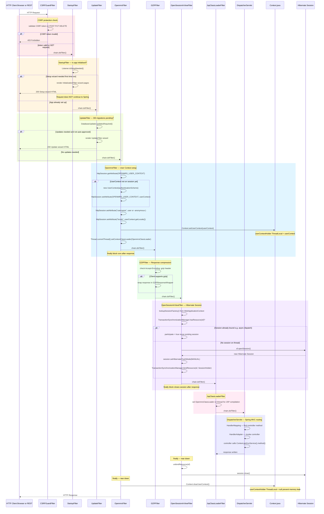
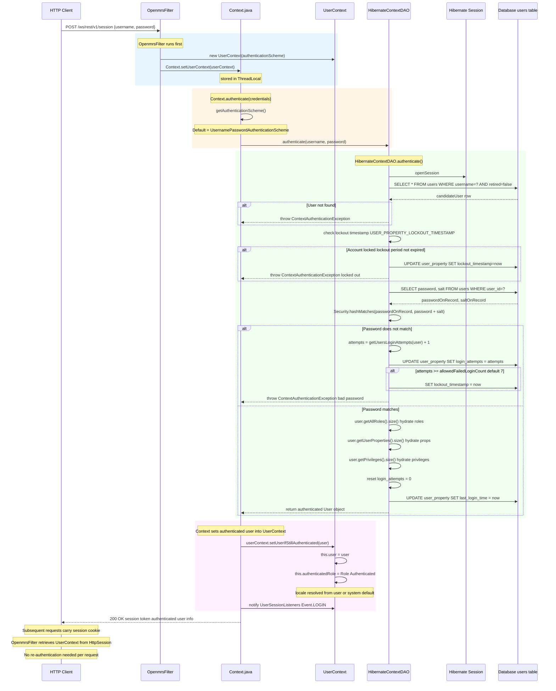
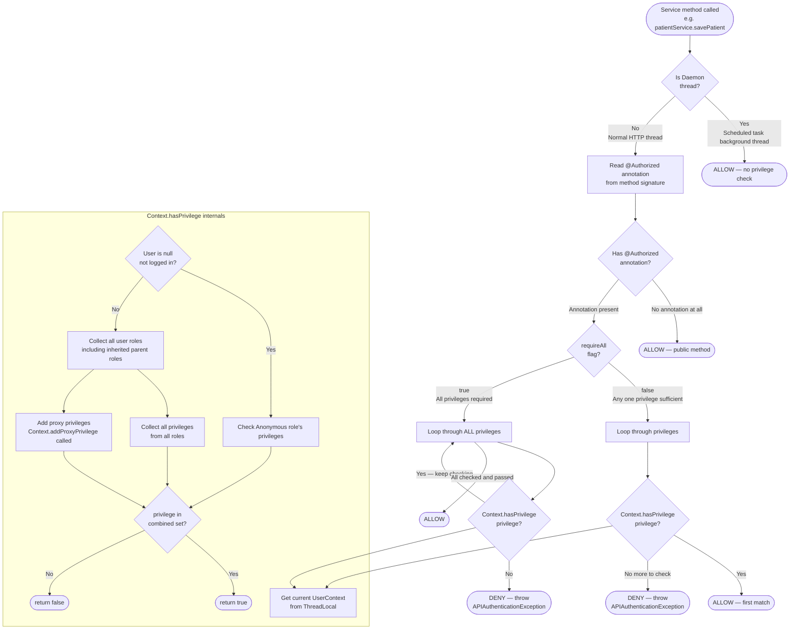
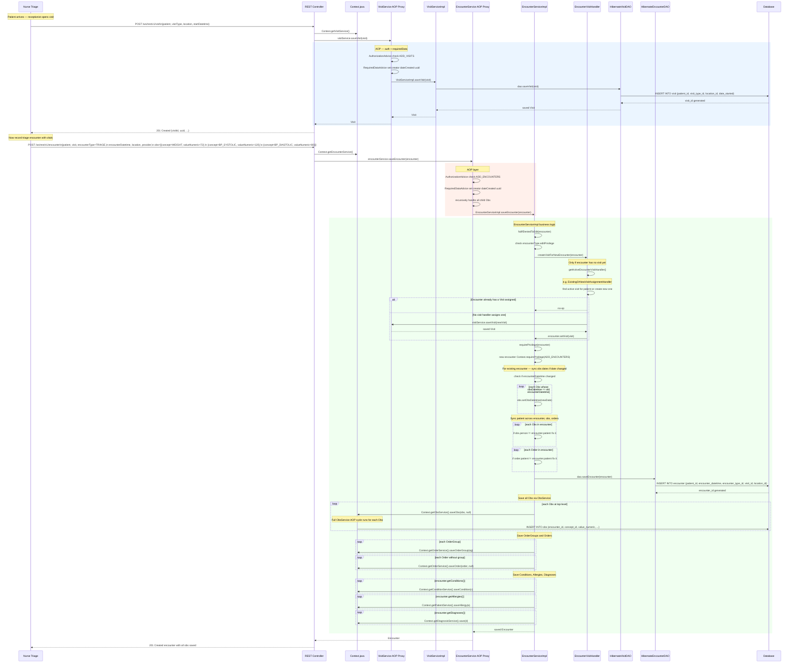

# OpenMRS Core — Complete Flow Reference
## Part 2: Execution Flows — AOP, HTTP, Auth, Registration, Clinical Data, Infrastructure

---

## 7. AOP Interceptor Chain (Detailed)

```mermaid
sequenceDiagram
    participant CALLER  as REST Controller
    participant PROXY   as Spring AOP Proxy
    participant AUTH    as AuthorizationAdvice
    participant REQDATA as RequiredDataAdvice
    participant LOG     as LoggingAdvice
    participant HANDLER as SaveHandler  VoidHandler  RetireHandler
    participant VALID   as Spring Validator
    participant IMPL    as PatientServiceImpl
    participant DAO     as HibernatePatientDAO
    participant HIB     as Hibernate Session

    CALLER ->> PROXY: patientService.savePatient(patient)

    Note over PROXY: Spring AOP proxy intercepts the call
    Note over PROXY: Runs all registered MethodBeforeAdvice in order

    rect rgb(255,235,235)
        Note over AUTH: INTERCEPTOR 1 — AuthorizationAdvice
        PROXY  ->> AUTH: before(method=savePatient, args=[patient], target)
        AUTH   ->> AUTH: read @Authorized on savePatient
        Note over AUTH: @Authorized({ADD_PATIENTS, EDIT_PATIENTS})
        AUTH   ->> AUTH: Daemon.isDaemonThread()
        alt Daemon thread — background scheduled task
            AUTH -->> PROXY: skip auth entirely — daemon bypasses all privilege checks
        else Normal HTTP request thread
            AUTH ->> AUTH: Context.addProxyPrivilege(GET_ROLES)
            loop each privilege in @Authorized annotation
                AUTH ->> AUTH: Context.hasPrivilege(privilege)
                AUTH ->> AUTH: UserContext.hasPrivilege(privilege)
                AUTH ->> AUTH: check user.getAllRoles() contains privilege
                alt User lacks ALL required privileges
                    AUTH -->> CALLER: throw APIAuthenticationException 401
                end
            end
            AUTH ->> AUTH: Context.removeProxyPrivilege(GET_ROLES)
            AUTH -->> PROXY: authorised — continue
        end
    end

    rect rgb(235,245,255)
        Note over REQDATA: INTERCEPTOR 2 — RequiredDataAdvice
        PROXY   ->> REQDATA: before(method=savePatient, args=[patient], target)
        REQDATA ->> REQDATA: methodName.startsWith("save") = true
        REQDATA ->> REQDATA: args[0] instanceof OpenmrsObject = true
        REQDATA ->> REQDATA: methodNameEndsWithClassName("savePatient", Patient) = true
        REQDATA ->> HANDLER: recursivelyHandle(SaveHandler.class, patient, null)

        loop Each SaveHandler that supports Patient.class
            HANDLER ->> HANDLER: handler.handle(patient, currentUser, date, other)
            HANDLER ->> HANDLER: if patient.creator == null  set creator = currentUser
            HANDLER ->> HANDLER: if patient.dateCreated == null  set dateCreated = now
            HANDLER ->> HANDLER: if patient.uuid == null  set uuid = UUID.randomUUID()
        end

        Note over HANDLER: Recurse into child collections
        loop patient.getNames() — each PersonName
            HANDLER ->> HANDLER: recursivelyHandle(SaveHandler, personName, null)
            HANDLER ->> HANDLER: set personName.creator, dateCreated, uuid
        end
        loop patient.getAddresses() — each PersonAddress
            HANDLER ->> HANDLER: recursivelyHandle(SaveHandler, personAddress, null)
        end
        loop patient.getIdentifiers() — each PatientIdentifier
            HANDLER ->> HANDLER: recursivelyHandle(SaveHandler, identifier, null)
        end

        REQDATA ->> VALID: ValidateUtil.validate(patient)
        VALID   ->> VALID: PersonValidator.validate()
        VALID   ->> VALID: check gender not blank
        VALID   ->> VALID: check birthdate not in future
        VALID   ->> VALID: check birthdate not > 140 years ago
        VALID   ->> VALID: PatientValidator.validate()
        VALID   ->> VALID: check at least one active identifier
        VALID   ->> VALID: check exactly one preferred identifier
        loop each PatientIdentifier
            VALID ->> VALID: PatientIdentifierValidator.validateIdentifier(pi)
            VALID ->> VALID: check identifier not blank
            VALID ->> VALID: check identifier matches format regex
            VALID ->> VALID: run configured IdentifierValidator  e.g. LuhnIdentifierValidator
            VALID ->> VALID: check uniqueness per UniquenessBehavior
        end
        alt Validation errors exist
            VALID -->> CALLER: throw ValidationException with BindingResult errors
        else No errors
            VALID -->> REQDATA: valid
        end
        REQDATA -->> PROXY: continue
    end

    rect rgb(235,255,235)
        Note over LOG: INTERCEPTOR 3 — LoggingAdvice
        PROXY ->> LOG: before(method, args, target)
        LOG   ->> LOG: log.debug entering PatientServiceImpl.savePatient
        LOG   -->> PROXY: continue
    end

    Note over PROXY: All advisors passed — invoke real method
    PROXY ->> IMPL: PatientServiceImpl.savePatient(patient)

    rect rgb(255,250,230)
        Note over IMPL: PatientServiceImpl Business Logic
        IMPL ->> IMPL: requireAppropriatePatientModificationPrivilege(patient)
        IMPL ->> IMPL: patient.id == null  require ADD_PATIENTS
        IMPL ->> IMPL: patient.id != null  require EDIT_PATIENTS
        IMPL ->> IMPL: patient.voided == true  require DELETE_PATIENTS
        IMPL ->> IMPL: if single identifier  force preferred=true
        IMPL ->> IMPL: checkPatientIdentifiers(patient)
        IMPL ->> IMPL: validate format, duplicates, required types
        IMPL ->> IMPL: setPreferredPatientIdentifier(patient)
        IMPL ->> IMPL: setPreferredPatientName(patient)
        IMPL ->> IMPL: setPreferredPatientAddress(patient)
        IMPL ->> DAO:  dao.savePatient(patient)
    end

    rect rgb(240,240,255)
        Note over DAO: HibernatePatientDAO
        DAO ->> HIB: sessionFactory.getCurrentSession()
        DAO ->> HIB: session.saveOrUpdate(patient)
    end

    rect rgb(255,240,240)
        Note over HIB: Hibernate fires Interceptors before flush
        HIB ->> HIB: AuditableInterceptor.onSave(entity, ...)
        HIB ->> HIB: set creator, dateCreated if null on INSERT
        HIB ->> HIB: set changedBy, dateChanged on UPDATE
        HIB ->> HIB: Envers captures revision to patient_aud table
        HIB ->> HIB: flush to DB  INSERT INTO person patient patient_identifier ...
    end

    DAO  -->> IMPL: saved Patient with generated IDs
    IMPL -->> PROXY: Patient
    PROXY -->> CALLER: Patient
```



---

## 8. Per-Request HTTP Filter Chain



---

## 9. Authentication and Session Flow



---

## 10. Privilege Check Flow



---

## 11. Patient Registration — Full Execution Flow

```mermaid
sequenceDiagram
    participant CLIENT   as Receptionist Browser
    participant REST     as REST Controller
    participant CTX      as Context.java
    participant AOP      as AOP Proxy
    participant AUTH     as AuthorizationAdvice
    parameter  RDA      as RequiredDataAdvice
    participant IMPL     as PatientServiceImpl
    participant VALID    as PatientValidator
    participant ID_VALID as PatientIdentifierValidator
    participant DAO      as HibernatePatientDAO
    participant HIB      as Hibernate  AuditableInterceptor  Envers
    participant DB       as Database

    CLIENT ->> REST: POST /ws/rest/v1/patient\n{names, gender, birthdate, addresses, identifiers}

    REST ->> REST: deserialize JSON to Patient + Person + PatientIdentifier objects
    REST ->> CTX:  Context.getPatientService()
    CTX  -->> REST: AOP-proxied PatientService bean

    REST ->> AOP: patientService.savePatient(patient)

    rect rgb(255,235,235)
        AOP ->> AUTH: AuthorizationAdvice.before()
        AUTH ->> AUTH: check @Authorized({ADD_PATIENTS, EDIT_PATIENTS})
        AUTH ->> AUTH: new patient  patient.id == null  check ADD_PATIENTS
        AUTH -->> AOP: authorised
    end

    rect rgb(235,245,255)
        AOP ->> RDA: RequiredDataAdvice.before()
        RDA ->> RDA: recursivelyHandle(SaveHandler, patient)

        Note over RDA: Set audit fields on Patient
        RDA ->> RDA: patient.creator     = receptionist User
        RDA ->> RDA: patient.dateCreated = NOW
        RDA ->> RDA: patient.uuid        = new UUID

        Note over RDA: Set audit fields on each PersonName
        loop patient.getNames()
            RDA ->> RDA: name.creator = receptionist User
            RDA ->> RDA: name.dateCreated = NOW
            RDA ->> RDA: name.uuid = new UUID
        end

        Note over RDA: Set audit fields on each PersonAddress
        loop patient.getAddresses()
            RDA ->> RDA: address.creator = receptionist User
            RDA ->> RDA: address.dateCreated = NOW
        end

        Note over RDA: Set audit fields on each PatientIdentifier
        loop patient.getIdentifiers()
            RDA ->> RDA: identifier.creator = receptionist User
            RDA ->> RDA: identifier.dateCreated = NOW
        end

        RDA ->> VALID: ValidateUtil.validate(patient)
        VALID ->> VALID: gender not blank
        VALID ->> VALID: birthdate not in future
        VALID ->> VALID: birthdate not > 140 years ago
        VALID ->> VALID: cause of death set if dead=true
        VALID ->> VALID: preferred identifier chosen
        loop each PatientIdentifier
            VALID ->> ID_VALID: validateIdentifier(pi)
            ID_VALID ->> ID_VALID: identifier not blank
            ID_VALID ->> ID_VALID: matches format regex of PatientIdentifierType
            ID_VALID ->> ID_VALID: run configured Validator  e.g. LuhnIdentifierValidator
            ID_VALID ->> ID_VALID: check uniqueness against DB  if UNIQUE behavior
            ID_VALID -->> VALID: valid or BindingResult errors
        end
        VALID -->> RDA: valid
        RDA  -->> AOP: continue
    end

    AOP ->> IMPL: PatientServiceImpl.savePatient(patient)

    rect rgb(255,250,230)
        IMPL ->> IMPL: requireAppropriatePatientModificationPrivilege
        IMPL ->> IMPL: single identifier  force preferred=true
        IMPL ->> IMPL: checkPatientIdentifiers(patient)
        IMPL ->> IMPL: validate identifiers again  check required types
        IMPL ->> IMPL: setPreferredPatientIdentifier
        IMPL ->> IMPL: setPreferredPatientName
        IMPL ->> IMPL: setPreferredPatientAddress
        IMPL ->> DAO: dao.savePatient(patient)
    end

    rect rgb(240,255,240)
        DAO ->> DAO: sessionFactory.getCurrentSession()
        DAO ->> HIB: session.saveOrUpdate(patient)
    end

    rect rgb(240,240,255)
        Note over HIB: Hibernate fires before flush
        HIB ->> HIB: AuditableInterceptor.onSave()
        HIB ->> HIB: set creator dateCreated if still null  double check
        HIB ->> DB: INSERT INTO person (person_id, gender, birthdate, ...) VALUES (...)
        HIB ->> DB: INSERT INTO patient (patient_id, allergy_status) VALUES (...)
        HIB ->> DB: INSERT INTO person_name (person_id, given_name, family_name, ...) VALUES (...)
        HIB ->> DB: INSERT INTO person_address (person_id, address1, city_village, ...) VALUES (...)
        HIB ->> DB: INSERT INTO patient_identifier (patient_id, identifier, identifier_type, ...) VALUES (...)
        HIB ->> DB: INSERT INTO person_aud  audit revision
        HIB ->> DB: INSERT INTO patient_aud  audit revision
        HIB ->> DB: INSERT INTO patient_identifier_aud  audit revision
        Note over HIB: Spring @Transactional commits
        HIB -->> DAO: patient with generated IDs
    end

    DAO  -->> IMPL: saved Patient
    IMPL -->> AOP:  saved Patient
    AOP  -->> REST: saved Patient

    REST ->> REST: serialize Patient to JSON response
    REST -->> CLIENT: 201 Created  {uuid, patientId, names, identifiers, ...}

    Note over CLIENT: Patient registered successfully
    Note over CLIENT: Hospital ID printed on patient card
```

---

## 12. Visit and Encounter Creation Flow



---

## 13. Observation (Obs) Save Flow

```mermaid
sequenceDiagram
    participant CALLER  as EncounterServiceImpl or direct REST
    participant OS      as ObsService AOP Proxy
    participant AUTH    as AuthorizationAdvice
    participant RDA     as RequiredDataAdvice
    participant IMPL    as ObsServiceImpl
    participant DAO     as HibernateObsDAO
    participant INT     as ImmutableObsInterceptor
    participant ENVERS  as Hibernate Envers
    participant DB      as Database

    CALLER ->> OS: obsService.saveObs(obs, changeMessage)

    rect rgb(255,235,235)
        OS ->> AUTH: AuthorizationAdvice.before()
        AUTH ->> AUTH: obs.obsId == null  check ADD_OBS
        AUTH ->> AUTH: obs.obsId != null  check EDIT_OBS
        AUTH -->> OS: authorised
    end

    rect rgb(235,245,255)
        OS ->> RDA: RequiredDataAdvice.before()
        RDA ->> RDA: set obs.creator, dateCreated, uuid
        RDA ->> RDA: if obs is group  recursively handle each groupMember
        RDA -->> OS: continue
    end

    OS ->> IMPL: ObsServiceImpl.saveObs(obs, changeMessage)

    rect rgb(240,255,240)
        IMPL ->> IMPL: null check on obs
        IMPL ->> IMPL: if obs.id != null and changeMessage == null  throw
        Note over IMPL: Editing an existing obs REQUIRES a change reason
        IMPL ->> IMPL: ens